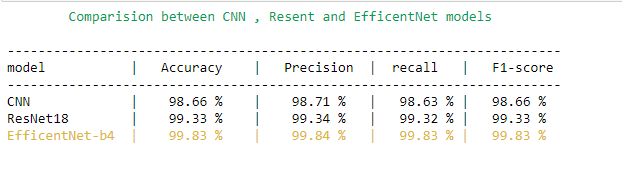

## qEB4d8oZs60bDV5V
This repository is about implementing a model witch detect if a page is flipped or not, using python, GPU and CUDA device. In this project, I implemented 3 different models: **EfficentNet, Resnet18 and CNN model.**

## MonReader: a computer vision appliction
## Description
MonReader is a new mobile document digitization experience for the blind, for researchers and for everyone else in need for fully automatic, highly fast and high-quality document scanning in bulk. It is composed of a mobile app and all the user needs to do is flip pages and everything is handled by MonReader: it detects page flips from low-resolution camera preview and takes a high-resolution picture of the document, recognizing its corners and crops it accordingly, and it dewarps the cropped document to obtain a bird's eye view, sharpens the contrast between the text and the background and finally recognizes the text with formatting kept intact, being further corrected by MonReader's ML powered redactor.

## Data Description:
The dataset was collected from page flipping video from smart phones and they was labelled as flipping and not flipping. The videos were clipped as short videos and was labelled as flipping or not flipping. The extracted frames are then saved to disk in a sequential order with the following naming structure: VideoID_FrameNumber

## Goal(s):
Predict if the page is being flipped using a single image.

## The planing of this work: 
* Data Exploration
* Splitting data into train, test and valid
* Data preprocessing
* Modelling part
* Results comparision
* Conclusion
### Above, the last results I've got while comparing the 3 used models.

### *But how I got it? Check the notebook to exlpore then!*
